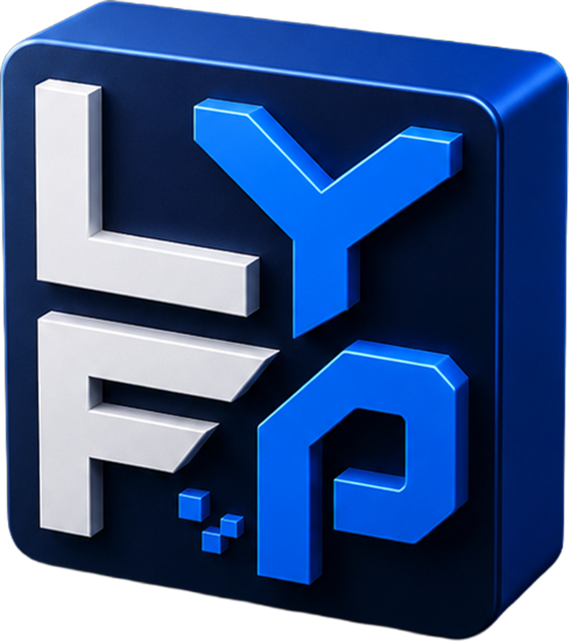

  

  <h1>LYFP Games Studio</h1>
  
<strong>Games · Animation · Creative Production</strong>

  
Independent studio crafting polished HTML5 games, game-ready 2D assets, and practical production tools.

  

    
    
    
  

---

## Build for play. Package for production.

LYFP creates browser games that are quick to enter, satisfying to control, and resilient across desktop, mobile, and Telegram. The same production practice powers a growing library of animated characters, enemies, bosses, and reusable tools for game creators.

| Browser games | Game-ready assets | Production tools |
|---|---|---|
| Responsive HTML5 experiences with clear controls and polished game feel. | Animation packs, atlases, controllers, references, and practical documentation. | Focused workflows for motion, UI, QA, packaging, and creative production. |

## Explore LYFP

| Destination | What you will find |
|---|---|
| **[LYFP Games Studio](https://lyfpstudio.com/)** | Play Pichone Fly, explore releases, and discover studio services. |
| **[LYFP Games](https://lyfpstudio.com/games/)** | Browser games and playable studio projects. |
| **[Telegram Game Hub](https://t.me/lyfpgames_bot)** | Open the LYFP game collection directly in Telegram. |
| **[Brainrot Lab](https://brainrotlab.xyz/)** | Experimental games, characters, and internet-culture projects. |
| **[Official Links](https://lyfpstudio.com/links/)** | Every verified studio, creator, community, and contact channel. |

## Selected games

- **Pichone Fly** — one-tap arcade flight with hazards, effects, and responsive controls.
- **Boneca Run Run** — a fast HTML5 endless runner built around rhythm and survival.
- **Brainrot Bubble Merge** — a relaxing physics merge game designed for browser portals.
- **Bombardino Arena** — a tactical survival shooter with waves, bosses, and evolving combat.

## Studio toolkit

  
  
  
  
  

## Connect with the studio

**[YouTube](https://www.youtube.com/@lyfpgames)** · **[Facebook](https://www.facebook.com/lyfpgames)** · **[Telegram community](https://t.me/lyfpgames)** · **[All official channels](https://lyfpstudio.com/links/)**

For collaborations involving character animation, game-ready assets, HTML5 prototypes, small games, or creative production, use the contact route on the **[official LYFP links page](https://lyfpstudio.com/links/)**.

  LYFP Games Studio · Quick Games. Big Fun.

